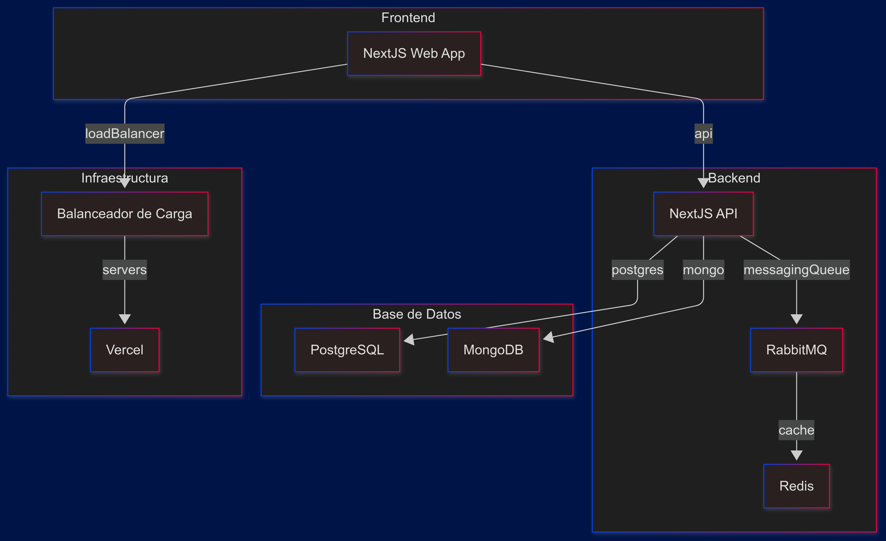
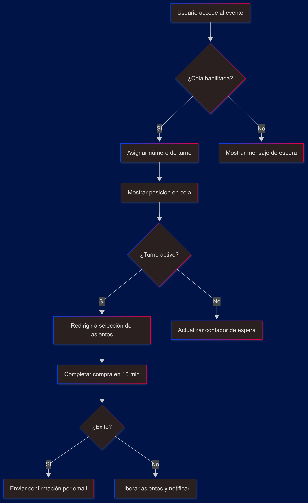

# Especificación de Requerimientos de Software (SRS)
## Teatro Mora Virtual

**Autor:** Camilo Vera Vidales

**Fecha:** 20 de abril de 2025

---

## 1. Introducción

### 1.1 Propósito del documento
Este documento describe la Especificación de Requerimientos de Software (SRS) para la aplicación **Teatro Mora Virtual**, destinada a gestionar eventos teatrales, ventas de boletos y foros interactivos para un teatro mediano.

### 1.2 Alcance del sistema
El sistema permitirá a María, administradora del Teatro Mora, crear y gestionar eventos, asignar actores, administrar colas virtuales para compra de boletos y proporcionar foros interactivos donde público y actores interactúan.

---

## 2. Requerimiento de negocio
María necesita una plataforma robusta que evite la caída de la web en lanzamientos de venta de boletos, gestione la demanda en tiempo real mediante una cola virtual y fomente la interacción con el público.

---

## 3. Casos de Uso Principales
Se identifican los 10 UC más críticos:

| UC ID | Nombre                          | Actor(es)             | Descripción breve                                |
|-------|---------------------------------|-----------------------|--------------------------------------------------|
| UC1   | Registrarse                     | Usuario               | Crear cuenta con correo y contraseña             |
| UC2   | Iniciar sesión                  | Usuario               | Autenticarse para acceder al sistema               |
| UC3   | Crear evento                    | María (Admin)         | Definir nombre, fecha, hora y descripción         |
| UC4   | Gestionar perfil de actor       | María (Admin)         | Añadir/editar/eliminar perfiles de actores        |
| UC5   | Ver detalles de evento          | Usuario               | Mostrar información, foro y botón de cola         |
| UC6   | Unirse a cola virtual           | Usuario               | Obtener número de turno                            |
| UC7   | Notificar turno y venta         | Sistema, Usuario      | Avisar al usuario cuando sea su turno             |
| UC8   | Seleccionar asientos            | Usuario               | Elegir ubicación en sala dentro de tiempo límite  |
| UC9   | Completar compra                | Usuario               | Procesar pago y generar boleto                    |
| UC10  | Participar en foro              | Usuario, María, Actor | Publicar y responder mensajes                     |

---

## 4. Requerimientos Funcionales

1. **RF001 - Registro de usuarios**: El sistema debe permitir crear cuentas con email y contraseña (UC1).
2. **RF002 - Autenticación**: Soportar login/logout seguro con sesiones (UC2).
3. **RF003 - Gestión de eventos**: CRUD de eventos para el administrador (UC3).
4. **RF004 - Gestión de actores**: CRUD de perfiles de actores (UC4).
5. **RF005 - Cola virtual**: Habilitar cola 1 hora antes y asignar turnos FIFO (UC6).
6. **RF006 - Notificaciones**: Enviar alertas en pantalla y correo al turno de compra (UC7).
7. **RF007 - Selección de asientos**: Mapa interactivo de sala con asientos disponibles (UC8).
8. **RF008 - Procesamiento de pago**: Integración con pasarela de pagos y emisión de boletos digitales (UC9).
9. **RF009 - Foro interactivo**: Publicación, edición y moderación de mensajes (UC10).
10. **RF010 - Administración de foro**: Eliminar/moderar mensajes inapropiados.

---

## 5. Requerimientos No Funcionales

| ID    | Categoría       | Descripción                                                                 |
|-------|-----------------|-----------------------------------------------------------------------------|
| RNF001| Rendimiento     | Soportar al menos 1.000 usuarios simultáneos en cola sin degradación > 2s.  |
| RNF002| Disponibilidad  | Disponibilidad mínima del 99.5% mensual.                                     |
| RNF003| Seguridad       | Encriptación TLS 1.2+, hashing de contraseñas con bcrypt.                    |
| RNF004| Escalabilidad   | Arquitectura basada en microservicios para escalar cola y pagos.             |
| RNF005| Usabilidad      | Cumplir estándares WCAG 2.1 AA.                                              |
| RNF006| Compatibilidad  | Funcionar en navegadores Chrome, Firefox, Safari y Edge.                     |
| RNF007| Mantenibilidad  | Código documentado con cobertura de pruebas ¿ 80%.                           |

---

## 6. Priorización de Requerimientos (MoSCoW)
- **Must have**: RF001, RF002, RF003, RF005, RF007, RF008.
- **Should have**: RF006, RF009.
- **Could have**: RF004, RF010.
- **Won't have**: Integración con redes sociales.

---

## 7. Reglas de Negocio

- **RN01**: Un usuario solo puede unirse a la cola de un evento una vez.
- **RN02**: El turno expira si no inicia compra en los siguientes 5 minutos.
- **RN03**: No se puede seleccionar más del 10% de asientos totales por usuario.
- **RN04**: Solo María (rol Admin) puede crear/modificar eventos y actores.

---

## 8. Diagramas de la Solución

### 8.1 Diagrama de Arquitectura

### 8.2 Diagrama de flujo de colas

---

## 9. Supuestos

1. Los usuarios disponen de conexión estable a Internet.
2. María gestiona previamente la lista de actores.
3. La pasarela de pagos ofrece una API REST con SLA adecuado.
4. No se consideran integraciones futuras con redes sociales.

---

## 10. Plan de Pruebas Inicial

### 10.1 Alcance de Pruebas
- **Se probará**: Registro, login, creación de eventos, cola virtual, compra de boletos, foro.
- **No se probará**: Integraciones externas no disponibles (redes sociales).

### 10.2 Tipos de Pruebas
- Funcionales: RF001-RF010.
- No funcionales: rendimiento (RNF001), seguridad (RNF003).
- Integración: pagos, notificaciones.
- Aceptación: validación con María.

### 10.3 Casos de Prueba (Listado)
| ID   | Descripción                                      | Req. Relacionado |
|------|--------------------------------------------------|------------------|
| TP01 | El usuario crea cuenta con email y contraseña    | RF001            |
| TP02 | Inicio de sesión con credenciales válidas        | RF002            |
| TP03 | María crea un evento correctamente                | RF003            |
| TP04 | Usuario se une a cola y recibe número de turno   | RF005            |
| TP05 | Usuario recibe notificación al llegar su turno   | RF006            |
| TP06 | Selección de asiento bloqueado si ya reservado   | RF007            |
| TP07 | Pago exitoso y emisión de boleto                 | RF008            |
| TP08 | Publicación y edición de mensaje en foro         | RF009            |

---
